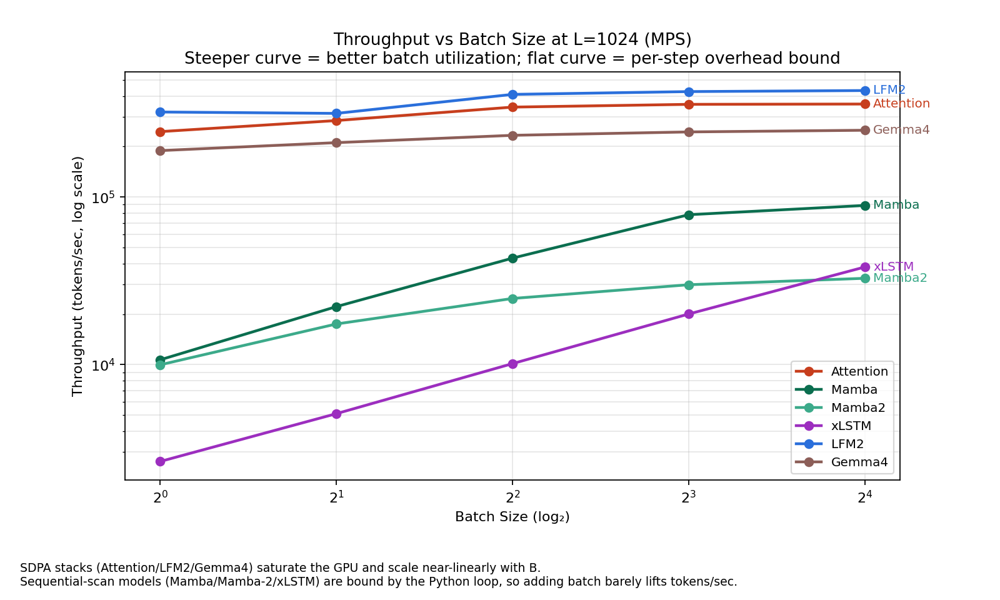
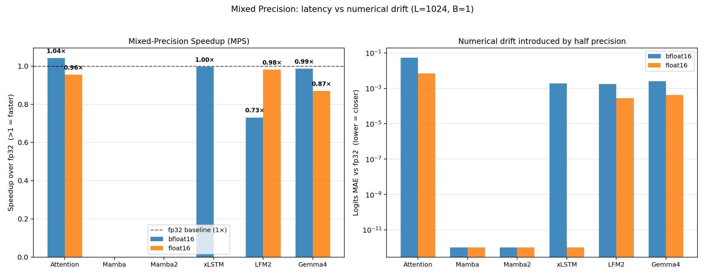

# AI Architecture Research

Pure-PyTorch reference implementations of six sequence modeling backbones — written to understand the design trade-offs of modern non-/post-Transformer architectures from first principles.

This repository is a research notebook, not a training framework. **Mamba**, **Mamba-2**, **xLSTM**, and **LFM2** are paper-guided implementations — each written to be read alongside its source paper. **Gemma 4** is a speculative reconstruction from the Gemma lineage, clearly labeled as such. **Attention** is a stripped-down baseline. Every smoke test runs on CPU in seconds; every benchmark in this README was produced on Apple M5 Pro (48 GB unified memory) with MPS enabled.

---

## The Question

The frontier of sequence modeling is contested between four architectural families. Each makes a fundamentally different bet about what carries information through a long context:

| Family            | Members in this repo  | What it carries                               | Per-step cost        | Total cost             |
| ----------------- | --------------------- | --------------------------------------------- | -------------------- | ---------------------- |
| **Attention**     | Attention (baseline)  | Full pairwise scores                          | O(L)                 | O(L²) memory + compute |
| **Selective SSM** | Mamba, Mamba-2        | Fixed-size SSM state                          | O(d_state · d_inner) | O(L) memory + compute  |
| **Extended LSTM** | xLSTM (mLSTM + sLSTM) | Matrix / scalar memory + log-space stabilizer | O(d_h²) (mLSTM)      | O(L) memory + compute  |
| **Hybrid**        | LFM2, Gemma 4         | Mix of attention + linear-time mixers         | layer-dependent      | O(L) + sparse O(L²)    |

This repo implements all four families at toy scale and benchmarks them across **seven dimensions**: parameter count, short-context inference time, long-context scaling (L up to 32k), peak memory, CPU vs MPS, batch-size throughput, and mixed-precision behavior.

---

## Implementations

### [Mamba](./mamba/) — Selective State Space Model

> Gu & Dao, *Mamba: Linear-Time Sequence Modeling with Selective State Spaces*, [arXiv:2312.00752](https://arxiv.org/abs/2312.00752) (2023)

The selective SSM core, in pure Python/PyTorch. The scan runs as a sequential recurrence loop — easy to read, but it sacrifices the parallelism of the official CUDA kernel. Includes the S4D-Real `A` initialization, the `dt_proj` bias trick, and GPT-NeoX-style residual rescaling.

### [Mamba-2](./mamba2/) — State-Space Duality

> Dao & Gu, *Transformers are SSMs: Generalized Models and Efficient Algorithms Through Structured State-Space Duality*, ICML 2024 ([arXiv:2405.21060](https://arxiv.org/abs/2405.21060))

The SSD restriction of Mamba: `A` becomes a scalar per head, `B`/`C` are shared across heads inside a "group", and `dt` is per-head. Five linear projections collapse into a single `in_proj` producing `[z, x, B, C, dt]` in one shot, and a mid-block RMSNorm sits between the SSM output and the gate. We keep a sequential scan for clarity; the chunk-parallel SSD form is what the official CUDA path uses.

### [xLSTM](./xlstm/) — Extended LSTM

> Beck et al., *xLSTM: Extended Long Short-Term Memory*, [arXiv:2405.04517](https://arxiv.org/abs/2405.04517) (2024)

Two cells stacked into the same residual backbone. **mLSTM** carries an outer-product matrix memory `C ∈ ℝ^{d_h × d_h}` per head; gates depend only on `x_t`, so it's parallelizable in the same way linear attention is. **sLSTM** carries a per-channel scalar `c` and is fully sequential, with block-diagonal recurrent matrices for the gates. Both cells share the **exponential gating + log-space stabilizer** trick that prevents `exp(·)` from blowing up after a few hundred steps. The toy config uses `("m", "s", "m", "s")` so both cells are present in the stack.

### [LFM2](./lfm2/) — Liquid Foundation Model 2

> LiquidAI, *LFM2 Technical Report*, [arXiv:2511.23404](https://arxiv.org/abs/2511.23404) (2025)

Hybrid backbone interleaving gated short-convolution blocks with GQA attention blocks in one residual stack. The toy config uses 4 layers with 2 attention layers (50% attention ratio) — this is **not** ratio-matched to the released `LiquidAI/LFM2-350M` checkpoint at 6/16 ≈ 37.5%. The toy is intentionally small for CPU runnability; benchmark numbers reflect this specific mix, not the production ratio.

### [Gemma 4](./gemma4/) — Speculative Reconstruction

> Synthesized from Google DeepMind, *Gemma 3 Technical Report* (2025) + Gemma 3n model card

**Gemma 4 has not released a public technical report.** This is a speculative reconstruction that assembles documented pieces of the Gemma lineage: Per-Layer Embeddings (PLE) from Gemma 3n, sliding-window + global attention interleaving from Gemma 3, sandwich norm from Gemma 2/3, and GeGLU FFN. Labeled speculative intentionally — the goal is reasoning about what Gemma 4 *likely* does, not claiming accuracy.

### Attention — Stripped-down Baseline

A 4-layer pre-norm transformer with `F.scaled_dot_product_attention` and a SwiGLU-free vanilla FFN, included to anchor every comparison against a known reference point.

---

## Experiments

All experiments use the same toy configuration: `hidden_size=128`, `num_layers=4`, `vocab_size=128`, `batch_size=1`, on Apple M5 Pro (48 GB unified memory). Inference benchmarks default to **MPS**; the CPU vs MPS section is the only one that runs both. Configs are intentionally minimal so experiments complete in seconds and results reflect architectural properties, not absolute throughput.

### 1. Model Size

Anchoring on parameter count first — every speed and memory curve below should be read with these in mind.

  

| Model                | Parameters |
| -------------------- | ---------- |
| Mamba                | 482,944    |
| Mamba-2              | 488,672    |
| Attention (baseline) | 674,048    |
| xLSTM                | 692,760    |
| LFM2                 | 837,632    |
| Gemma4               | 838,016    |

The two Mamba variants are nearly identical at this scale — Mamba-2's SSD restriction (A scalar per head, B/C grouped) buys away the per-channel `dt` projection budget. xLSTM's parameter count is dominated by the up/down projections around the matrix-memory cells. LFM2 and Gemma 4 are roughly equivalent: LFM2 spends the budget on attention + conv projections, Gemma 4 additionally on the per-layer embedding path.

---

### 2. Short-Context Behavior (L ≤ 1024, MPS)

At toy scale the SDPA-based stacks dominate everything else by an order of magnitude — including the linear-recurrence models that are theoretically supposed to win at long L.

  

| L    | Attention  | Mamba   | Mamba-2 | xLSTM    | LFM2       | Gemma 4 |
| ---- | ---------- | ------- | ------- | -------- | ---------- | ------- |
| 16   | **2.0 ms** | 2.7 ms  | 3.3 ms  | 7.4 ms   | 3.6 ms     | 3.0 ms  |
| 128  | **1.8 ms** | 12.3 ms | 12.8 ms | 45.5 ms  | 1.7 ms     | 4.4 ms  |
| 512  | **1.1 ms** | 44.5 ms | 49.2 ms | 177.9 ms | 2.7 ms     | 4.3 ms  |
| 1024 | 3.6 ms     | 87.9 ms | 93.2 ms | 359.5 ms | **2.9 ms** | 5.6 ms  |

**Why the SSM/RNN models look bad here.** All three sequential-scan models (Mamba, Mamba-2, xLSTM) execute their state recurrence as a Python `for` loop on the GPU. Each step is a tiny matmul that dispatches to MPS, synchronizes, and returns — pure dispatch overhead, no parallelism to amortize it. xLSTM is the slowest of the three because every step does both the matrix-memory update *and* the (per-channel) sLSTM scalar recurrence; Mamba and Mamba-2 do roughly equivalent per-step work. The official CUDA paths for these models replace the Python loop with a fused parallel scan, which is what removes the gap.

**Why LFM2 outpaces even the bare attention baseline.** LFM2's gated short-conv blocks are pure conv1d + matmul on a 1D residual stream, no causal mask construction needed. At L=1024 LFM2 finishes in 2.9 ms vs Attention's 3.6 ms — the smaller per-step constant outweighs the conv overhead at this scale.

---

### 3. Long-Context Scaling (L up to 32,768, MPS)

Pushing `L` to 32k surfaces the architectural crossover the linear-time designs are built for.

  

| L          | Attention     | Mamba        | Mamba-2      | xLSTM         | LFM2          | Gemma 4 |
| ---------- | ------------- | ------------ | ------------ | ------------- | ------------- | ------- |
| 512        | 1 ms          | 44 ms        | 46 ms        | 176 ms        | 2 ms          | 3 ms    |
| 2048       | 1 ms          | 171 ms       | 182 ms       | 713 ms        | 10 ms         | 12 ms   |
| 8192       | 1 ms          | 699 ms       | 761 ms       | 2,838 ms      | 115 ms        | 198 ms  |
| 16,384     | 1 ms          | 1,431 ms     | 1,532 ms     | 5,799 ms      | 517 ms        | 941 ms  |
| **32,768** | **44,045 ms** | **3,398 ms** | **3,210 ms** | **12,262 ms** | **19,087 ms** | **OOM** |

At L=32k the picture inverts completely: dense attention takes **44 seconds** for a single forward, while Mamba-2 finishes in 3.2 s — a **14× swing** in favor of the SSM. The crossover happens between L=16k and L=32k, exactly where the O(L²) curve and the O(L) curve intersect for these specific constants.

**Mamba-2 ≈ Mamba at long context.** Their per-step cost is similar in this Python-reference form, so both land at ~3 s for 32k tokens. The architectural difference between them shows up in *memory*, not time (next section).

**xLSTM stays linear in L but with a large constant.** ~12 s at L=32k is a Python-loop story, not an asymptotic one — every step does an outer-product update on a `d_h × d_h` matrix.

**LFM2 hits the same O(L²) wall as attention at long L.** At 50% attention layers, LFM2's full-attention blocks dominate when L gets big enough; at L=32k it takes 19 s, slightly over half of the dense attention time. A production-ratio LFM2 (37.5% attention) would do better.

**Gemma 4 OOMs at L=32k.** The current `_sliding_causal_mask` materializes a dense `(L, L)` boolean tensor even when `sliding_window=512`. At 32k that mask alone is 1 GB, and the unified-memory pool runs out. This is a reference-implementation quirk, not a Gemma 4 design flaw.

---

### 4. Memory Footprint (L up to 32,768, MPS)

Where time costs separate the architectures by an order of magnitude, memory costs separate them by **two**. The chart is on log-log axes for that reason.

  

| L          | Attention      | Mamba         | Mamba-2       | xLSTM         | LFM2           | Gemma 4        |
| ---------- | -------------- | ------------- | ------------- | ------------- | -------------- | -------------- |
| 1,024      | 1,057 MiB      | 1,088 MiB     | 104 MiB       | 98 MiB        | 81 MiB         | 89 MiB         |
| 4,096      | 1,584 MiB      | 1,128 MiB     | 328 MiB       | 216 MiB       | 1,608 MiB      | 1,608 MiB      |
| 8,192      | 4,192 MiB      | 1,224 MiB     | 1,576 MiB     | 392 MiB       | 3,216 MiB      | 4,248 MiB      |
| 16,384     | 13,888 MiB     | 1,320 MiB     | 2,088 MiB     | 1,640 MiB     | 13,872 MiB     | 15,732 MiB     |
| **32,768** | **52,224 MiB** | **2,568 MiB** | **3,080 MiB** | **2,184 MiB** | **52,224 MiB** | **52,224 MiB** |

The 52,224 MiB readings at L=32k are a unified-memory ceiling indicator — at that point the MPS allocator has saturated the 48 GB pool plus swap. The interesting comparison is at L=16,384 where every model still fits in physical memory:

- **xLSTM is the most memory-efficient at long context (1.6 GB).** Each head only carries a `(d_h, d_h)` matrix and a `(d_h,)` normalizer, so total state is `H · d_h² + H · d_h ≈ H · d_h²`. With `H=4, d_h=48` (proj_factor=1.5) this is on the order of MB regardless of L.
- **Mamba (1.3 GB) ≈ Mamba-2 (2.1 GB)**, both well below the attention stacks at the same L.
- **Attention / LFM2 / Gemma 4 all scale super-linearly** because they materialize an `(H, L, L)` score matrix at some layer. LFM2 at 13.9 GB and Attention at 13.9 GB land essentially identically at L=16k — the 50% conv layers in LFM2 don't help once the attention layers have allocated the score tensor.

The methodology: peak memory is the larger of (i) `torch.mps.driver_allocated_memory()` delta or (ii) `resource.ru_maxrss` delta, captured in a fresh subprocess to keep baselines clean. This is process-level, not per-tensor — it captures the working-set growth a real inference engine would experience.

---

### 5. CPU vs MPS (Apple M5 Pro, 48 GB Unified Memory)

Apple Silicon's unified memory pool means both CPU and MPS see the same 48 GB, so the question isn't *can we fit on the GPU* but *do we want to*.

  

  

| Model         | L        | CPU      | MPS       | Speedup                                  |
| ------------- | -------- | -------- | --------- | ---------------------------------------- |
| **LFM2**      | 512      | 13 ms    | 2 ms      | **5.6×**                                 |
| **LFM2**      | 1,024    | 14 ms    | 3 ms      | **4.8×**                                 |
| LFM2          | 4,096    | 33 ms    | 24 ms     | 1.4×                                     |
| LFM2          | 8,192    | 99 ms    | 95 ms     | 1.0×                                     |
| LFM2          | 32,768   | 1,230 ms | 18,666 ms | 0.07× *(MPS thrashes)*                   |
| **Gemma 4**   | 512      | 8 ms     | 3 ms      | **2.3×**                                 |
| **Gemma 4**   | 4,096    | 104 ms   | 52 ms     | 2.0×                                     |
| Gemma 4       | 16,384   | 1,146 ms | 906 ms    | 1.3×                                     |
| **Attention** | 512      | 3 ms     | 2 ms      | 1.4×                                     |
| Attention     | 4,096    | 42 ms    | 41 ms     | 1.0×                                     |
| Attention     | 16,384   | 558 ms   | 777 ms    | 0.7× *(CPU faster)*                      |
| Mamba         | all      | —        | —         | **0.55–0.92×** *(MPS slower throughout)* |
| Mamba-2       | 512 only | 134 ms   | 48 ms     | **2.8×**                                 |
| Mamba-2       | 1,024+   | —        | —         | **0.6–0.8×** *(CPU faster from L=2k)*    |
| xLSTM         | all      | —        | —         | **0.34–0.53×** *(MPS slower throughout)* |

**Recurrent models hate MPS.** Mamba, Mamba-2, and xLSTM all run a Python `for` loop on the GPU; each step is a small kernel launch and a sync. The dispatch latency dwarfs the compute. xLSTM is the worst hit (3× slower on MPS) because every step does both the matrix-memory update and the per-head normalizer. **Mamba-2 has a single sweet spot at L=512** where MPS pulls 2.8× ahead — for that one length the kernel call is large enough to dominate launch overhead, but it inverts immediately after.

**SDPA stacks (LFM2, Gemma 4) win at short context.** LFM2 at L=512 is 5.6× faster on MPS — the conv1d + GQA layout maps cleanly to Metal kernels and there's no sequential dependency.

**The crossover at L≈8k.** Above that, the `(H, L, L)` score tensor saturates Metal's memory subsystem, and at L=32k LFM2 thrashes badly (0.07×). For long-context experimentation on this hardware, the rule of thumb is: SDPA stacks below L=4k → MPS; everything else → CPU.

---

### 6. Throughput vs Batch Size (L=1024, MPS)

Sequence length held constant at 1024; only the batch dimension grows. The question is which architectures actually amortize their per-step overhead and turn the extra FLOPs into more tokens per second.

  

| B                 | Attention   | Mamba      | Mamba-2    | xLSTM      | LFM2        | Gemma 4     |
| ----------------- | ----------- | ---------- | ---------- | ---------- | ----------- | ----------- |
| 1                 | 245,551     | 10,675     | 9,967      | 2,640      | 321,501     | 189,167     |
| 2                 | 285,866     | 22,166     | 17,464     | 5,091      | 315,421     | 211,044     |
| 4                 | 343,901     | 43,154     | 24,794     | 10,127     | 409,571     | 233,372     |
| 8                 | 357,216     | 78,383     | 29,943     | 20,024     | 425,668     | 244,529     |
| 16                | **358,720** | **89,019** | **32,715** | **38,202** | **431,796** | **250,207** |
| **B=16/B=1 lift** | **1.46×**   | **8.34×**  | **3.28×**  | **14.47×** | **1.34×**   | **1.32×**   |

The result is the opposite of what you might expect: **the Python-loop models get the largest batch lift**, not the SDPA stacks. xLSTM goes 14.5× from B=1 to B=16, Mamba 8.3×. The reason is that Python overhead per scan step is fixed; widening the batch tensor doesn't add Python iterations, only compute, so the overhead amortizes.

The SDPA stacks (Attention, LFM2, Gemma 4) only gain 1.3–1.5× because they're already saturating the GPU at B=1 — the matmul kernels are large enough that MPS schedules them efficiently from the start.

**Absolute numbers still favor SDPA.** LFM2 at B=16 still pushes ~430k tokens/sec versus xLSTM's 38k. Sequential scan models close the *relative* gap with batch but never the absolute gap.

---

### 7. Mixed Precision: fp32 vs bf16 vs fp16 (L=1024, MPS)

For each model we run forward at three dtypes and measure both wall-clock latency and the mean absolute error of logits relative to the fp32 anchor.

  

| Model     | fp32      | bf16 (×, MAE)  | fp16 (×, MAE)  |
| --------- | --------- | -------------- | -------------- |
| Attention | 3.46 ms   | 1.04× , 5.5e-2 | 0.96× , 6.9e-3 |
| Mamba     | 93.62 ms  | SKIPPED        | SKIPPED        |
| Mamba-2   | 97.02 ms  | SKIPPED        | SKIPPED        |
| xLSTM     | 367.94 ms | 1.00× , 1.9e-3 | SKIPPED        |
| LFM2      | 3.15 ms   | 0.73× , 1.8e-3 | 0.98× , 2.7e-4 |
| Gemma 4   | 5.44 ms   | 0.99× , 2.5e-3 | 0.87× , 4.1e-4 |

**Why most rows are SKIPPED.** Mamba, Mamba-2, and xLSTM (in fp16) hit MPS ops that aren't yet implemented at half precision — primarily `Conv1d` and certain `exp`/`scatter` paths. The graceful failure path turns those into SKIPPED entries.

**Why the speedups are modest at this scale.** The toy config is 128-dim, 4-layer, batch=1; total FLOPs per forward are too small for half-precision matmul to pay back the casting cost. On a real 1B+ model the bf16/fp16 lift is typically 1.5–2× on MPS — the toy setup just doesn't exercise the regime where that matters.

**bf16 vs fp16 numerical drift, calibrated.** Attention's bf16 logit MAE is 5.5e-2 — about an order of magnitude looser than fp16's 6.9e-3, exactly what you'd predict from the mantissa bits (bf16 has 7, fp16 has 10). For the linear-time models that *do* run at half precision, MAEs sit in the 1e-3 to 1e-4 range; the log-space stabilizer in xLSTM keeps `exp(·)` bounded, so the gates don't blow up under bf16.

The pragmatic takeaway: at this toy scale, mixed precision is a correctness-and-compatibility experiment, not a speed experiment. The speed experiment lives at full-model scale.

---

## Figures

All figures and JSON results land in `notebooks/figures/`.

---

## What This Is Not

- **Not a training framework** — no dataloaders, optimizers, checkpointing, or distributed training
- **Not production code** — layout prioritizes readability over installability
- **Not benchmarked at scale** — toy configs run in seconds; absolute numbers don't transfer to full-size models
- **Not a faithful Gemma 4 implementation** — Gemma 4 weights and architecture are not public; this is a reasoned reconstruction from documented Gemma lineage components
- **Not a CUDA-kernel rewrite** — every scan is a Python `for` loop. The CUDA paths for Mamba/Mamba-2/xLSTM are precisely what removes the per-step dispatch overhead surfaced in the benchmarks above

---

## References

- Gu, A. & Dao, T. (2023). Mamba: Linear-Time Sequence Modeling with Selective State Spaces. [arXiv:2312.00752](https://arxiv.org/abs/2312.00752)
- Dao, T. & Gu, A. (2024). Transformers are SSMs: Generalized Models and Efficient Algorithms Through Structured State-Space Duality. ICML 2024. [arXiv:2405.21060](https://arxiv.org/abs/2405.21060)
- Beck, M., Pöppel, K., Spanring, M., Auer, A., Prudnikova, O., Kopp, M., Klambauer, G., Brandstetter, J., Hochreiter, S. (2024). xLSTM: Extended Long Short-Term Memory. [arXiv:2405.04517](https://arxiv.org/abs/2405.04517)
- LiquidAI (2025). LFM2 Technical Report. [arXiv:2511.23404](https://arxiv.org/abs/2511.23404)
- Google DeepMind (2025). Gemma 3 Technical Report.
- HuggingFace Transformers source: `modeling_gemma3.py`, `modeling_gemma3n.py`, `modeling_lfm2.py`
- Official reference implementations: [state-spaces/mamba](https://github.com/state-spaces/mamba), [NX-AI/xlstm](https://github.com/NX-AI/xlstm)

