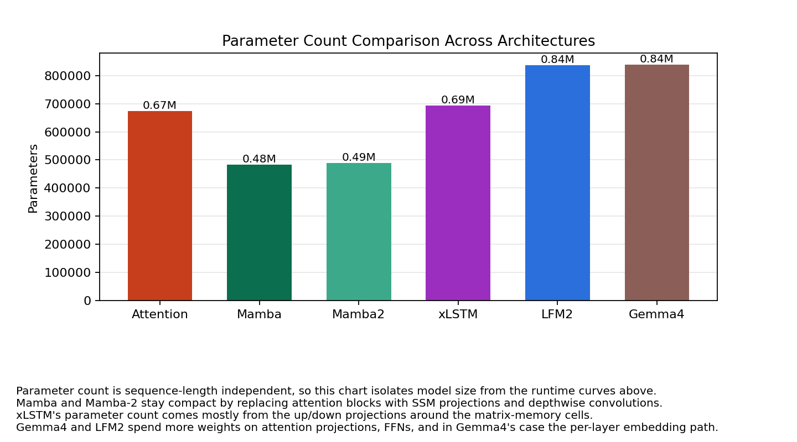
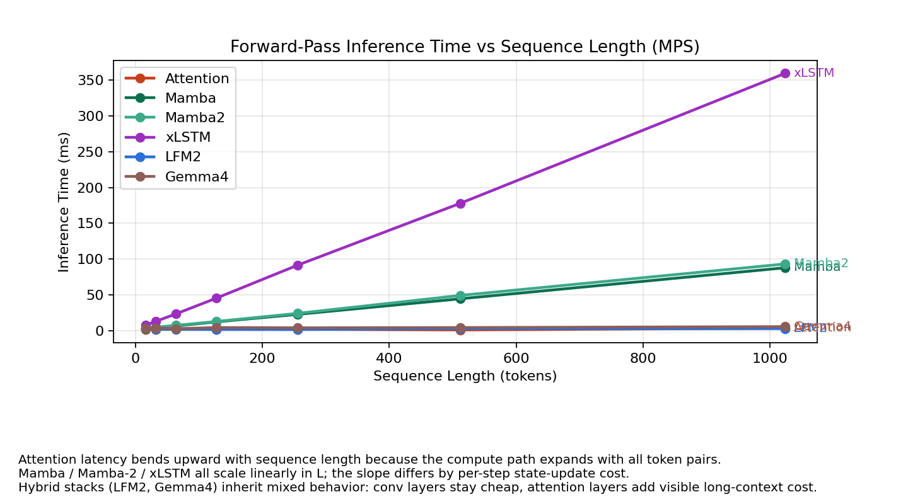
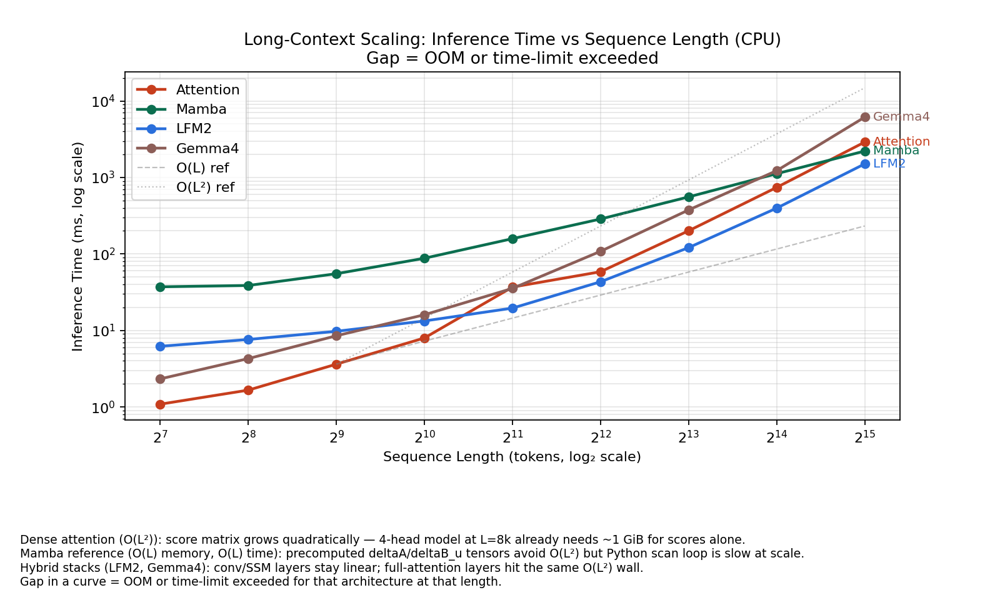
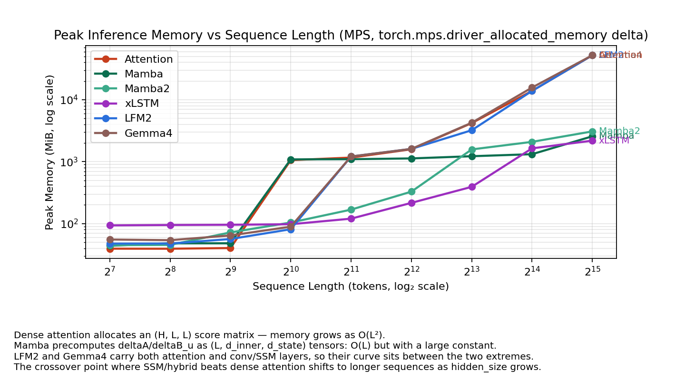
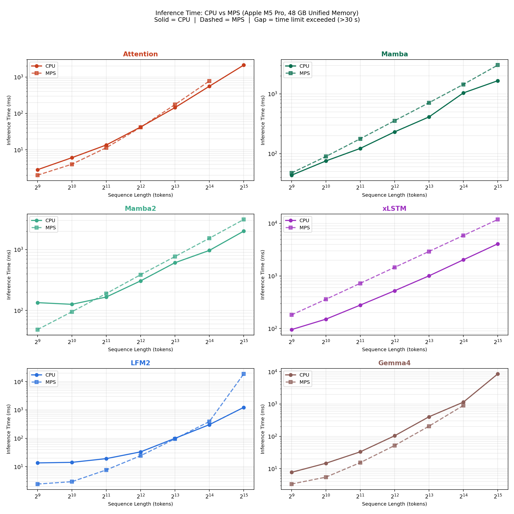
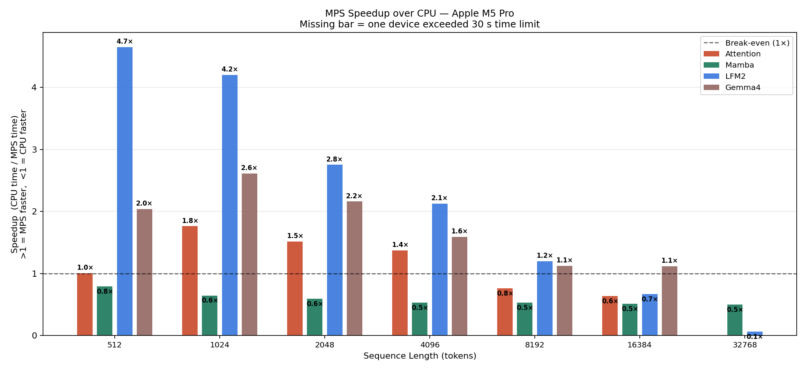

# AI Architecture Research

Pure-PyTorch reference implementations of three competing sequence modeling paradigms — SSM, Hybrid, and Attention — written to understand their design trade-offs from first principles.

This repository is a research notebook, not a training framework. Mamba and LFM2 are paper-guided implementations — each written to be read alongside its source paper. Gemma 4 is a speculative reconstruction from the Gemma lineage, clearly labeled as such. All experiments run on CPU in minutes; no GPU is required.

---

## The Question

The next generation of foundation models is contested between three architectural paradigms. Each makes a fundamentally different bet:

| Architecture | Time Complexity | Memory | Long-Range | Core Bet |
|---|---|---|---|---|
| **Attention** (Gemma 4) | O(L²) | O(L²) | Exact | Hardware scales faster than the quadratic cost |
| **SSM** (Mamba) | O(L) | O(L) | Selective | Linear recurrence captures enough of what attention sees |
| **Hybrid** (LFM2) | O(L) + sparse O(L²) | O(L) | Both | Neither alone wins; mixing is the right inductive bias |

This repo implements all three at toy scale and benchmarks them across memory, inference speed, and hardware (CPU vs Apple Silicon GPU), surfacing where theory meets — and diverges from — practice.

---

## Implementations

### [Mamba](./mamba/) — Selective State Space Model

> Gu & Dao, *Mamba: Linear-Time Sequence Modeling with Selective State Spaces*, arXiv:2312.00752 (2023)

The selective SSM core, implemented in pure Python/PyTorch without CUDA kernels. The scan runs as a sequential recurrence loop, which makes the state transition structure easy to follow but sacrifices the parallelism of the official CUDA implementation. Includes the S4D-Real `A` matrix initialization, the `dt_proj` bias trick from the paper, and GPT-NeoX-style residual scaling.

### [LFM2](./lfm2/) — Liquid Foundation Model 2

> LiquidAI, *LFM2 Technical Report*, arXiv:2511.23404 (2025)

Hybrid backbone interleaving 10 gated short-convolution blocks with 6 GQA attention blocks in a single residual stack. The toy config uses 4 layers with 2 attention layers (50% attention ratio) — this is **not** ratio-matched to the released `LiquidAI/LFM2-350M` checkpoint, which sits at 6/16 ≈ 37.5%. The toy config is intentionally small for CPU runnability; the benchmark numbers reflect this specific mix, not the production ratio. The key architectural insight — that convolution and attention can share a residual stream without structural gymnastics — is immediately visible in `forward()`.

### [Gemma 4](./gemma4/) — Speculative Reconstruction

> Synthesized from: Google DeepMind, *Gemma 3 Technical Report* (2025) + Gemma 3n model card

**Gemma 4 has not released a public technical report.** This is a speculative reconstruction that assembles documented pieces of the Gemma lineage: Per-Layer Embeddings (PLE) from Gemma 3n, sliding-window + global attention interleaving from Gemma 3, sandwich norm from Gemma 2/3, and GeGLU FFN. Labeled speculative intentionally — the goal is reasoning about what Gemma 4 *likely* does, not claiming accuracy.

---

## Experiments

All benchmarks use the same toy configuration: `hidden_size=128`, `num_layers=4`, `vocab_size=128`, `batch_size=1`, run on Apple M5 Pro CPU (48 GB unified memory). Configs are intentionally minimal so experiments complete in seconds and results reflect architectural properties, not absolute throughput.

### 1. Model Size

Before running any sequence-length experiments, it's worth anchoring on parameter count — since architectural overhead (extra projections, embeddings, norms) affects both the numerics and the interpretation of the speed curves.

  

| Model | Parameters |
|-------|-----------|
| Mamba | 483K |
| Attention (baseline) | 674K |
| LFM2 | 838K |
| Gemma4 | 838K |

Mamba is the most compact: SSM projections and a depthwise convolution replace the full QKV projection stack. LFM2 and Gemma4 are roughly equivalent in size, but their parameter budgets are spent differently — LFM2 on attention + conv projections, Gemma4 additionally on the per-layer embedding path.

---

### 2. Short-Context Behavior: Theory vs. Practice

At toy scale (seq_len ≤ 1024), vanilla attention outperforms every other architecture — including both models theoretically designed to beat it.

  

| seq_len | Attention | Mamba | LFM2 | Gemma4 |
|---------|-----------|-------|------|--------|
| 16 | **1.2 ms** | 67.4 ms | 16.3 ms | 3.2 ms |
| 128 | **3.5 ms** | 67.4 ms | 9.9 ms | 7.1 ms |
| 512 | **7.8 ms** | 132 ms | 28.7 ms | 15.0 ms |
| 1024 | **16.9 ms** | 192 ms | 25.6 ms | 55.0 ms |

This is not surprising once you understand what each architecture actually allocates at this scale.

**Why Mamba is slow here.** The Python reference implementation precomputes `deltaA` and `deltaB_u` as `(batch, L, d_inner, d_state)` tensors before entering the sequential recurrence loop. At `L=1024`, `d_inner=256`, `d_state=16`, this tensor alone is `1 × 1024 × 256 × 16 × 4 bytes ≈ 16 MB` — already larger than the attention score matrix. The theoretical O(L) advantage requires a parallel associative scan (the official CUDA kernel's core contribution); the Python loop trades that for readability.

**Why LFM2 and Gemma4 lag.** Neither architecture is doing anything exotic at small scale — they're just carrying overhead that a stripped-down attention baseline doesn't have: gated convolutions, per-layer embeddings, QK-RMSNorm, sandwich norms, dual RoPE. These costs dominate when sequence length is short and the quadratic term in attention is negligible.

---

### 3. Long-Context Scaling: Where the Bets Pay Off

Extending the sequence range to L=32,768 reveals the architectural crossover the SSM and hybrid designs are built for.

  

| seq_len | Attention | Mamba | LFM2 | Gemma4 |
|---------|-----------|-------|------|--------|
| 512 | 3.6 ms | 55.2 ms | 9.8 ms | 8.5 ms |
| 2,048 | 36.9 ms | 158.5 ms | 19.6 ms | 35.5 ms |
| 8,192 | 200.9 ms | 556.9 ms | 121.0 ms | 376.1 ms |
| 16,384 | 741.1 ms | 1,119.4 ms | 397.0 ms | 1,226.5 ms |
| **32,768** | **2,901 ms** | **2,213 ms** | **1,505 ms** | 6,141 ms |

**LFM2 wins at L=32k**, running in 1.5s versus 2.9s for attention — nearly 2× faster. Only 2 of its 4 layers use full attention; the other 2 use gated short-convolution, which stays O(L) regardless of sequence length. This is the hybrid design's core payoff: attention where precision matters, convolution where it doesn't.

**Mamba crosses over between L=16k and L=32k.** The O(L) recurrence eventually absorbs the O(L²) score computation, but only after the Python scan loop overhead is amortized over a long-enough sequence. The crossover at L~16k–32k is consistent with what published benchmarks report for production-scale models (where CUDA parallel scan removes the loop penalty entirely).

**Gemma4 is the slowest at L=32k**, despite a sliding-window attention design intended to limit the quadratic cost. The global attention layers (`global_attn_every_n=2`, so every other layer) are still full O(L²), and per-layer embeddings add an extra embedding-table lookup at every layer. At L=32k this accumulates to 6.1s — more than twice the attention baseline.

The crossover from "attention wins" to "SSM/hybrid wins" happening around **L=16k–32k** is not an accident of this toy config; it reflects the same threshold reported in production-scale evaluations.

---

### 4. Memory Footprint

  

| seq_len | Attention | Mamba | LFM2 | Gemma4 |
|---------|-----------|-------|------|--------|
| 1,024 | 10.8 MiB | 62.3 MiB | 13.9 MiB | 27.7 MiB |
| 4,096 | 33.2 MiB | 241.7 MiB | 47.1 MiB | 286.8 MiB |
| 8,192 | 61.4 MiB | 477.9 MiB | 84.8 MiB | 1,054.7 MiB |
| 16,384 | 118.0 MiB | 972.9 MiB | 165.5 MiB | 4,014.1 MiB |
| **32,768** | **230.5 MiB** | **1,897.5 MiB** | **330.2 MiB** | **11,606 MiB** |

Three patterns stand out:

**Attention's memory is surprisingly modest in this config.** The score matrix is `(batch, heads, L, L) × 4 bytes`, so at 4 heads and L=32k it's `4 × 32768² × 4 = 16 GB` in theory — but `torch.nn.functional.scaled_dot_product_attention` uses Flash Attention under the hood on this platform, tiling the computation to avoid materializing the full matrix. The measured 230 MiB at L=32k is a process-level RSS delta (`resource.ru_maxrss`), capturing the peak working-set growth during inference rather than individual tensor allocations. It likely understates true peak activation memory; the point is that the O(L²) score tensor is never resident in memory simultaneously.

**Mamba's memory grows linearly but with a large constant.** The `(b, L, d_inner, d_state)` precomputed tensors account for most of the 1.9 GB at L=32k. This is a Python-reference artifact; the CUDA implementation fuses the scan and avoids this allocation.

**Gemma4's memory explodes quadratically.** The `_sliding_causal_mask` method materializes a dense `(L, L)` boolean mask even when `sliding_window=512`. At L=32k that's `32768² × 1 byte ≈ 1 GB` just for the mask, before any activations. The 11.6 GB reading at L=32k is dominated by this bug — the sliding-window design doesn't deliver its memory promise at this reference implementation level.

**LFM2 is the most memory-efficient hybrid.** Its curve tracks just above attention, reflecting the two non-attention layers staying at O(L) activation cost.

---

### 5. CPU vs. Apple Silicon GPU (MPS)

Apple Silicon's unified memory architecture — where CPU and GPU share the same physical memory pool — changes the usual VRAM-constrained GPU story. The M5 Pro's 48 GB are accessible to both the CPU and the MPS (Metal Performance Shaders) backend, making large-context experiments feasible without an external GPU. We benchmarked all four architectures on both devices to characterize when MPS actually helps.

  

  

| Model | seq_len | CPU | MPS | Speedup |
|-------|---------|-----|-----|---------|
| **LFM2** | 512 | 14.6 ms | 3.1 ms | **4.7×** |
| **LFM2** | 1,024 | 15.6 ms | 3.7 ms | **4.2×** |
| **LFM2** | 4,096 | 53.6 ms | 25.2 ms | 2.1× |
| **LFM2** | 8,192 | 126.4 ms | 105.3 ms | 1.2× |
| LFM2 | 16,384 | 414.0 ms | 619.4 ms | 0.67× *(CPU faster)* |
| **Gemma4** | 512 | 8.7 ms | 4.3 ms | **2.0×** |
| **Gemma4** | 4,096 | 107.6 ms | 67.6 ms | 1.6× |
| Gemma4 | 8,192 | 392.7 ms | 348.7 ms | 1.1× |
| Attention | 1,024 | 8.0 ms | 4.5 ms | 1.8× |
| Attention | 8,192 | 198.1 ms | 260.2 ms | 0.76× *(CPU faster)* |
| **Mamba** | all | — | — | **~0.5× (MPS slower throughout)** |

The results reveal a consistent pattern: **MPS delivers meaningful speedups at short-to-medium context, but the advantage reverses sharply at long context.**

**LFM2 benefits most from MPS at short context (4.7×).** The gated convolution and attention projections map well onto Metal's matrix kernels, and at small sequence lengths the memory traffic stays within MPS's fast bandwidth. The crossover happens around L≈8k, after which the growing attention score tensors saturate Metal's memory subsystem faster than the CPU's sequential compute path.

**Mamba is consistently hurt by MPS (~2× slower across all lengths).** The `selective_scan` is a Python `for` loop: each iteration is a tiny matrix multiply that dispatches to the GPU, waits for synchronization, and returns — pure dispatch overhead with no parallelism to amortize it. No amount of GPU memory bandwidth helps a sequential dependency chain.

**Attention on MPS inverts unexpectedly at L>8k.** Below L=4k, MPS is 1.4–1.8× faster. Above L=8k, CPU is faster, and at L=32k MPS exceeds the 30-second time limit (versus 2.9s on CPU). The likely cause: unlike the CPU path (which routes through Flash Attention's tiled kernel), the MPS backend at this PyTorch version materializes the full `(H, L, L)` score tensor in GPU memory, triggering Metal's paging behavior under memory pressure.

**Practical guidance for this hardware:** MPS is worth using for LFM2 and Gemma4 at L≤4k (e.g., repeated short-context forward passes during analysis). For long-context experiments (L≥8k), CPU is equal or better for every model. Mamba should always run on CPU in this reference implementation.

---

## What This Is Not

- **Not a training framework** — no dataloaders, optimizers, checkpointing, or distributed training
- **Not production code** — layout prioritizes readability over installability
- **Not benchmarked at scale** — all results use toy configs that run in seconds on CPU; absolute numbers don't transfer to full-size models
- **Not a faithful Gemma 4 implementation** — Gemma 4 weights and architecture are not public; this is a reasoned reconstruction from documented Gemma lineage components

---

## References

- Gu, A. & Dao, T. (2023). Mamba: Linear-Time Sequence Modeling with Selective State Spaces. [arXiv:2312.00752](https://arxiv.org/abs/2312.00752)
- LiquidAI (2025). LFM2: Scalable and Efficient Foundation Models Built for Systems. [arXiv:2511.23404](https://arxiv.org/abs/2511.23404)
- Google DeepMind (2025). Gemma 3 Technical Report.
- HuggingFace Transformers source: `modeling_gemma3.py`, `modeling_gemma3n.py`, `modeling_lfm2.py`
